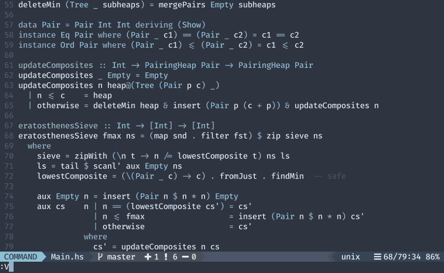
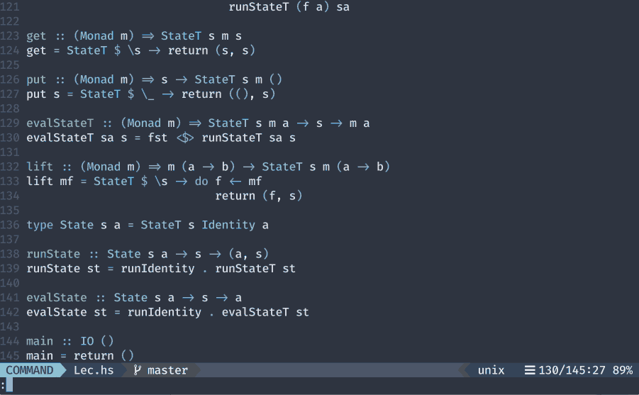

# Vimdo -- Asynchronous Executor

A configurable plugin to execute external commands asynchronously. This is a
rewrite of an unpublished plugin I wrote before async was around.

## Demo

### Shell command and user defined command


### User defined background command with callback


## Requirements

Neovim >= `0.2` for most of the stuff to work. Version `0.4` or above
recommended.

## Installation

[vim-plug](https://github.com/junegunn/vim-plug)

Add the following line to your `init.vim`

```vim
Plug 'macthecadillac/vimdo'
```
## Usage

The following commands are available:

`Vimdo`: `Vimdo {cmd}` where `cmd` is the sub-command you defined (see the
section below). This will execute the command you configured.

`VimdoList`: List all the defined sub-commands available for the current file
type

`VimdoProcs`: List all background processes launched through `Vimdo`
(those that run not in the terminal but in the background)

`VimdoStop`: Terminate process with the provided process number.  `VimdoStop
{#}` where `#` is the process number listed by `VimdoListProcs`.

`VimdoFloats`: List all the float terminals opened by `Vimdo`.

`VimdoCloseFloat`: Close the floating window with the provided window ID.
`VimdoCloseFloat {#}` where `#` is the window ID listed by `VimdoFloats`.

`VimdoBang`: `VimdoBang {cmd}` where `cmd` is a shell command. This is an
asynchronous version of the usual vim bang command. This follows the global
configuration.

`VimdoBangS`: `VimdoBangS {cmd}` where `cmd` is a shell command. This is the
same as `VimdoBang` with the exception that it prints the stdout output to a
new split.

## Configuration

Configurations can be global or local. Global configurations reside in your
global configuration (usually in `init.vim`) whereas local configurations live
in `.vimdo.vim` in your local directory (either in the same folder as the file in
buffer or in the root of the `git` repository). Local configurations, if found,
always have precedence over global configurations.

### Hooks to shell commands

All hooks reside in `g:vimdo#cmds`. It is a dictionary that maps
`Vimdo` sub-commands to shell commands. The dictionary must contain keys (as
`string`'s) that are vim `filetype`'s. The value of the each entry is another
dictionary that must contain this entry:

  - `cmd`: `string` The command to be invoked

Aside from `cmd`, you can include any valid configuration keys in the dictionary
and these will have precedence over the global/file type configurations.

One extra key that is not available as a configuration key is `callback`:

  - `callback`: `string` Name of the callback function. The callback
                function takes a list of strings as its only argument.

Instead of being specific file types, the first level keys could optionally be a
wildcard, in this case `*` that serves as a catch-all, and all its commands will
be available for all file types. Notice that file type specific commands will
override catch-all commands if conflicts arise.

Example:

```vim
let g:vimdo#cmds = {
      \ '*': {
      \     'update-ctags': {
      \       'cmd': 'ctags -R -h --exclude={.git}',
      \       'with_filename': 0,
      \     },
      \   },
      \ 'rust': {
      \     'run': {'cmd': 'cargo run', 'with_filename': 0, 'in_term': 1},
      \     'release-build': {
      \       'cmd': 'cargo build --release',
      \       'in_term': 1
      \     },
      \   },
      \ 'haskell': {
      \     'type': {
      \        'cmd': ['stack', 'exec', 'hhpc', '--', 'type',
      \                'vimdo#util#filename', 'vimdo#util#line', 'vimdo#util#col'],
      \        'show_stdout_in_float': 1,
      \        'in_term': 0,
      \        'callback': 'ProcessTypeResults',
      \      }
      \   },
      \ }

function! ProcessTypeResults(text)
  let l:o = ['']
  let l:s = 100000
  let l:col = col('.')
  for l:line in a:text
    let l:output = split(l:line, '"')
    if l:output !=# []
      let l:num = split(l:output[0])
      " if start and end aren't on the same line then it is not just for the
      " word the cursor is sitting on
      if l:num[0] ==# l:num[2]
        let l:d1 = abs(l:num[1] - l:col)
        let l:d2 = abs(l:num[3] - l:col)
        let l:s1 = l:d1 + l:d2
        if l:s1 < l:s
          let l:o = [l:output[1]]
          let l:s = l:s1
        endif
      endif
    endif
  endfor
  return l:o
endfunction
```

For further configuration options, please refer to the documentation.

## License

MIT
